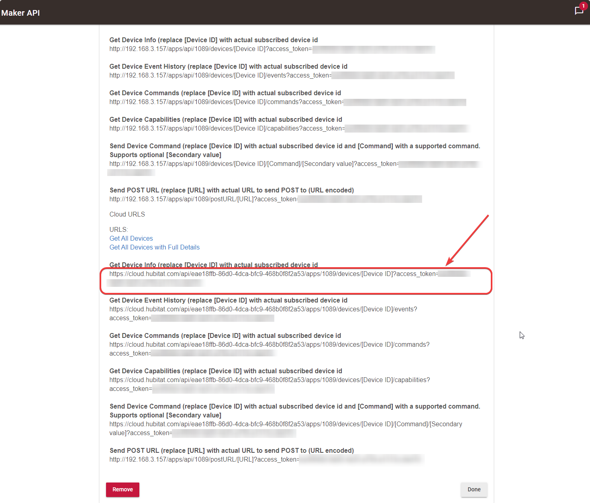
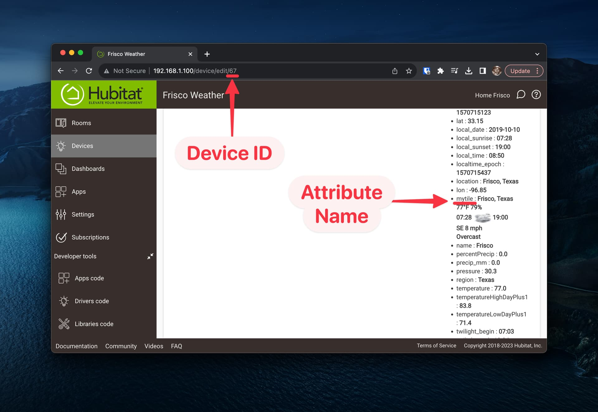
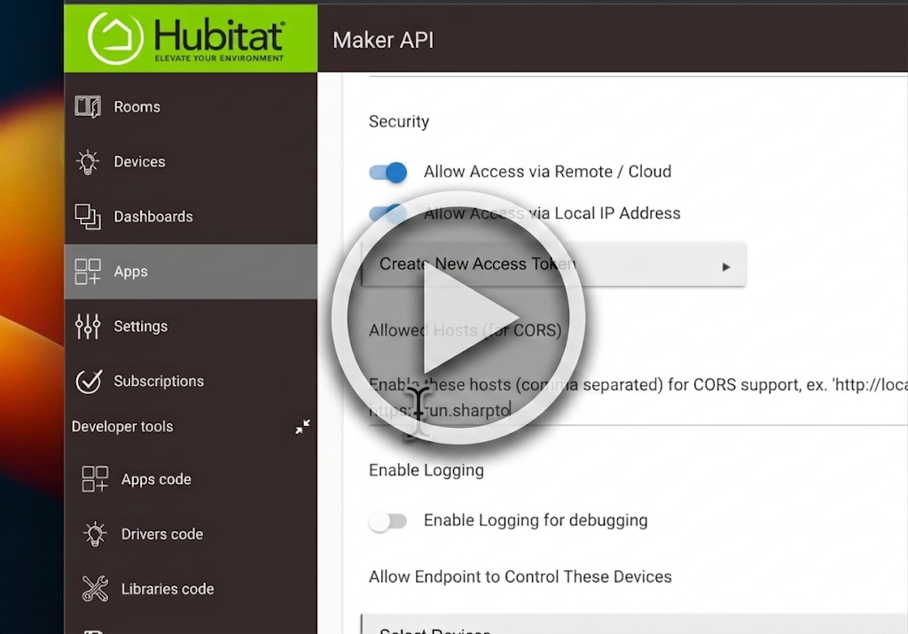
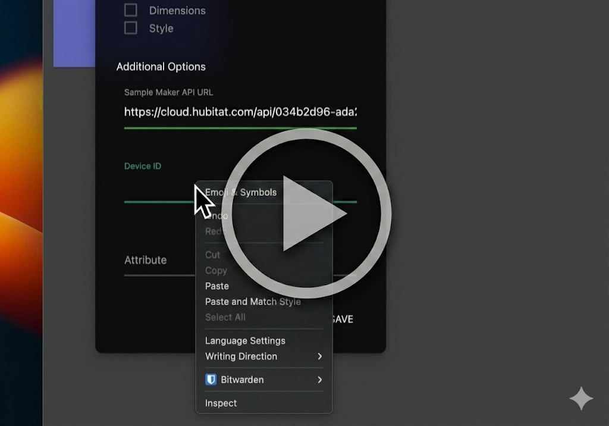

## Hubitat Maker API - With HTML Support
This is a proof-of-concept for reading data from a device using the Hubitat Maker API and displaying it in a tile. This particular 
variant supports a 'hack' which is common in some Hubitat community devices wherein the attribute is stuffed with HTML data.

While normal tiles on a SharpTools dashboard won't render the HTML as a security precaution, this proof-of-concept DOES render the HTML.
This rendering of HTML is allowed in SharpTools Custom Tiles since they are running in a sandboxed context.

> **WARNING**: You should still only run Custom Tile code (and thus injected HTML) from _trusted_ sources! The injected HTML still has 
access to other items within the context of the Custom Tile.

> [!TIP]
> We recently released a new version of the [HTML Attribute Display Custom Tile](https://community.sharptools.io/t/hubitat-html-attribute-display/6597) which uses the newer direct access to SharpTools Things, supports realtime status updates, and doesn't depend on the Hubitat Maker API. 
>
> We recommend using the newer version as it is more efficient and doesn't rely on polling like this Hubitat Maker API version did. 

### Enable Hubitat Maker API

Follow the steps below to enable Maker API in Hubitat admin page.

* Install the [Maker API app](https://docs.hubitat.com/index.php?title=Maker_API) and select the device(s) that you want to display
* Enable **Allow Access via Remote/Cloud**
* Add `https://run.sharptools.app/` in the **Allowed Hosts (for CORS)** field
* Scroll down and copy one of the example cloud endpoints
* Make sure to press **Done** to save your changes!

### Create Custom Tile

* Tap the [Import button](https://sharptools.io/developer/custom-tiles/import/?url=https%3A%2F%2Fraw.githubusercontent.com%2Fjoshualyon%2Fcustom-tile-demos%2Fmain%2Fhe-maker-api-html%2FheMakerApiTile.html) above to import the tile, then scroll down and save the tile
  * Optionally, press Preview to try out the tile without saving (you’ll need the details from the Enable Hubitat Maker API section above)
* Go to the desired dashboard, Edit, and Add Item. Tap “Custom Tile” in the Other section and add this custom tile.
* Edit the tile, fill-in the settings, and save:
  * **Sample Maker API Url** - use one of the Hubitat Maker API Cloud endpoints
    
  * **Device ID** - enter the ID of a device with an attribute stuffed with HTML
    * Note that you can find the device ID in the URL of your browser when you are viewing a devices details within the Hubitat Admin UI page
  * **Attribute** - enter the name of the attribute that is stuffed with html
    

> **Note**: To simplify development and sharing purposes, the `tileSettings` variable within the code has been stubbed with these values. The proper
approach to this would be to add Tile Settings in your Custom Tile for each of these settings and uncomment line 23 in `stio.ready()` which would copy 
your per-tile user configured settings into the variable. By using the Tile Settings, it allows you to create multiple copies of the tile with various different 
configurations. 

# Video Demo

## Setup Hubitat Maker API

## Import and Configure Custom Tile
